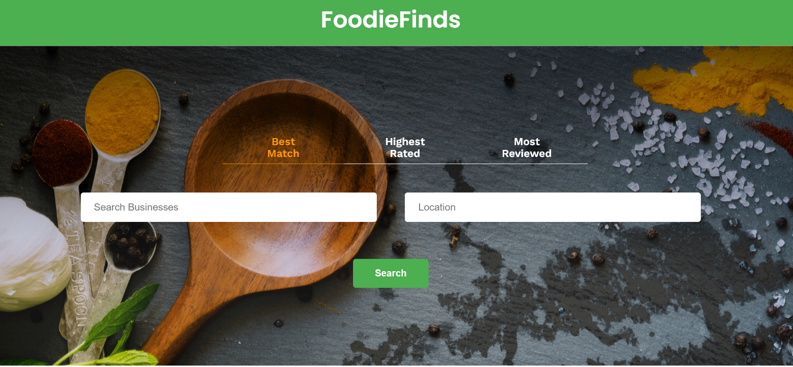

# Foodie Finds
<!-- Project Description -->
The "Foodie Finds" website is a web application that serves as your ultimate culinary companion, designed to help users explore and discover the finest dining experiences in their local area. Whether you're a seasoned food enthusiast or simply looking for your next delicious meal, Foodie Finds has you covered.

**Technologies Used:**
- React.js
- JavaScript
- HTML
- CSS
- Git and GitHub
- Yelp API

**Features:**

1. **Restaurant Discovery:** Easily search for and discover restaurants, cafes, food trucks, and eateries at a specific location.
2. **Keyword-Based Search:** Fine-tune your search by specifying keywords such as cuisine type and dish.
3. **Detailed Listings:** Access comprehensive restaurant listings with vital information, including adress, and ratings.
5. **Sorting Options:** Sort search results by best match, highest rated, or most reviewed to find the perfect dining spot.
6. **User-Friendly Interface:** Enjoy an intuitive and user-friendly interface that makes restaurant exploration a breeze.
7. **Responsive Design:** Access Foodie Finds on various devices, ensuring a seamless user experience on desktops, tablets, and smartphones.

<!-- Image GIF of project -->


## Installation and Usage
<!-- How to install and run the project? -->
Code will run in the browser instead of the terminal. To use it:
1. Make sure you are in *foodie_finds* folder, after *cloning/downloading* repo to your system.
2. From the root project directory, run on terminal:
    ```bash
    npm install
    ```
    to install all necessary dependencies. (You will just need to do this once)
4. Go to `src/utils/yelpAPI.js` and provide your Yelp API key in the value of the constant variable `yelpAPIkey`. To get Yelp API key, go here: [Yelp Developers](https://www.yelp.com/developers)
5. After installation, and providing the yelpAPI key. Start the server on your terminal:
    ```bash
    npm start
    ```
5. Open [http://localhost:3000](http://localhost:3000) to view it in your browser. The page will reload when you make changes.
6. To exit/end, press '**ctrl+c**' on the terminal, close the browser.

## Credits

Tutorials, materials referenced from Codecademy:
- [Create a Front-End App with React](https://www.codecademy.com/learn/paths/build-web-apps-with-react)
- [Front-End Engineer Career Path](https://www.codecademy.com/learn/paths/front-end-engineer-career-path)