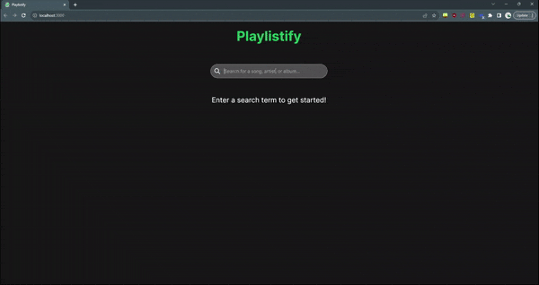

# Playlistify

Playlistify is a Single Page Web Application (SPA) that enables you to explore the Spotify library, create personalized playlists, and save them directly to your Spotify account. Whether you want to curate your favorite songs, discover new tracks, or share your musical tastes with the world, Playlistify has got you covered.



## Technologies Used

- **React.js**: A powerful JavaScript library for building user interfaces.
- **JavaScript**: The backbone of web development, used for adding interactivity and functionality.
- **HTML**: The standard markup language for creating web pages.
- **Tailwind CSS**: A utility-first CSS framework for rapid and responsive web development.
- **Git and GitHub**: Version control and collaborative platform for code management.
- **Spotify API**: Integrating Spotify's API to access the vast music library and manage playlists.

## Features

Playlistify offers the following features:

- **Spotify Integration**: Seamlessly connect to your Spotify account to access your playlists, discover new music, and manage your tracks.
- **Search and Explore**: Search for songs, albums, and artists within Spotify's extensive catalog.
- **Create Custom Playlists**: Compile your own playlists by adding and arranging tracks to suit your mood and preferences.
- **Save to Spotify**: Save your custom playlists directly to your Spotify account to enjoy them across all your devices.
- **Authorization**: Securely authorize access to your Spotify account using the implicit grant flow from OAuth 2.0 standards.

## Installation and Usage

To install and run Playlistify on your local machine, follow these steps:

1. Clone or download the repository to your system.

2. Navigate to the "playlistify" folder.

3. Install all necessary dependencies by running the following command in your terminal:

   ```bash
   npm install
   ```

   This is a one-time setup.

4. Configure the Spotify API:

   - Go to `src/utils/spotifyAPI.js`.

   - Replace `CLIENT_ID` with your Spotify Client ID. If you don't have one, follow the steps outlined in the [Spotify API](#spotify-api) section to obtain it.

5. Start the server by running the following command in your terminal:

   ```bash
   npm start
   ```

6. Open [http://localhost:3000](http://localhost:3000) in your web browser. You will need to sign in and authorize access to your Spotify account.

7. To stop the application, press `Ctrl + C` in the terminal, and you can close your browser.

### Spotify API

Playlistify relies on the Spotify API to provide you with a seamless music experience. To get started:

1. Create a Spotify Developer profile.

2. Create a new app with the following details:

   - App Name: Playlistify

   - Description: An app to create custom playlists on Spotify

   - Redirect URI: Set this to `http://localhost:3000/` or your local app mount point for authorization purposes.

3. Obtain your Spotify Client ID.

Learn more about Spotify API usage in the [Spotify API](https://developer.spotify.com/documentation/web-api/concepts/apps) section.

Playlistify uses the Implicit Grant Flow from OAuth 2.0 for authorization, making it a straightforward and secure process.

Learn about the [Implicit Grant Flow](https://developer.spotify.com/documentation/web-api/tutorials/implicit-flow) for more details.

## Future Improvements

Playlistify is an evolving project, and here are some future improvements in the pipeline:

### Immediate Features to Work On

1. **Search with Enter Key**: Enable users to initiate a search by simply pressing the "Enter" key, offering a more intuitive search experience.

2. **Track Preview Samples**: Enhance the song listings by providing preview samples for each track, allowing users to preview songs before adding them to their playlists.

3. **Filter Existing Playlist Tracks**: Modify the search results to display only songs that are not already present in the user's playlist, helping to avoid duplicates in custom playlists.

4. **Loading Screen for Playlist Saving**: Implement a loading screen or progress indicator during the playlist saving process, offering a better user experience.

5. **Optimize Token Expiration Logic**: Refine the access token logic to expire at precisely the right time, instead of setting expiration from when the user initiates their next search, ensuring a more secure and reliable authorization process.

6. **Restore Search Term on Login Redirect**: When a user is redirected after login, maintain the search term from before the redirect, preserving the continuity of their search.

7. **Persistent Playlist Information**: Ensure that playlist information doesn't get cleared, even if a user has to refresh their access token. This guarantees a seamless playlist management experience.

8. **Fetch Existing Playlists**: Add functionality for users to fetch and view all their existing playlists, making it easier to manage and organize their music collection.

### Necessary Improvements:

- **Enhanced Authorization**: Implement more secure forms of authorization, such as a login portal or authorization code with PKCE flow. [Learn more](https://developer.spotify.com/documentation/web-api/tutorials/code-pkce-flow)

- **Performance Optimization**: Optimize performance by reducing the number of renders through the use of the `useCallback` React hook.

- **Hosting Solution**: Explore hosting options to make Playlistify accessible to a broader audience.

## Credits

This project was made possible with the help of tutorials and learning materials from Codecademy's Front-End Engineer Career Path, which includes the [Create a Front-End App with React](https://www.codecademy.com/learn/paths/build-web-apps-with-react) course.

For a comprehensive journey into front-end development, check out the [Front-End Engineer Career Path](https://www.codecademy.com/learn/paths/front-end-engineer-career-path).

Get ready to embark on your music discovery adventure with Playlistify! Create, explore, and enjoy custom Spotify playlists like never before.
